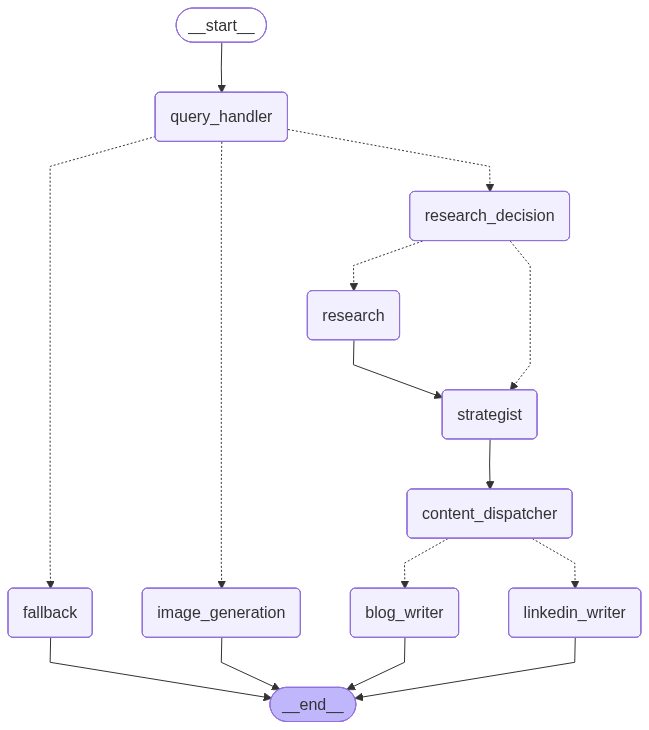

# Content Blitz AI

**Content Blitz AI** is an agentic AI content generation platform
designed to turn user requests into research-backed, high-quality
content.

The system uses specialized agents, tool calling, external research,
multiple LLM providers, memory, evaluation pipelines, and image
generation to support content workflows such as:

-   📝 Blog generation
-   💼 LinkedIn post generation
-   🎨 AI image generation
-   🔎 Research and information synthesis

------------------------------------------------------------------------

# 🏗️ Architecture

## Agentic Architecture

> **Agentic Architecture Diagram**

Place the agentic architecture diagram in the project at:

``` text
docs/agentic_architecture.png
```



------------------------------------------------------------------------

## AWS Deployment Architecture

> **AWS Deployment Architecture Diagram**

Place the AWS architecture diagram in the project at:

``` text
docs/aws_architecture.png
```


------------------------------------------------------------------------

# ✨ Key Features

-   Agent-based content generation
-   Intent classification and routing
-   Research decision agent
-   Web research and retrieval
-   Research synthesis
-   Blog generation
-   LinkedIn content generation
-   AI image generation
-   Tool-based execution
-   PostgreSQL + pgvector memory
-   Redis-based application support
-   Multiple LLM providers
-   RAGAS-based research evaluation
-   LLM-as-a-Judge final output evaluation
-   FastAPI backend
-   Frontend application
-   Docker-based deployment
-   AWS deployment architecture

------------------------------------------------------------------------

# 🤖 Agentic Workflow

At a high level, the application follows this workflow:

``` text
                    User Request
                         │
                         ▼
                ┌─────────────────┐
                │ Intent / Router │
                └────────┬────────┘
                         │
          ┌──────────────┼──────────────┐
          │              │              │
          ▼              ▼              ▼
       Research         Blog         LinkedIn
          │              │              │
          │              │              │
          ▼              │              │
     Web Search           │              │
          │              │              │
          ▼              │              │
   Research Synthesis     │              │
          │              │              │
          └──────────────┼──────────────┘
                         │
                         ▼
                  Final Response
```

The actual implementation contains specialized agents, tools, prompts,
workflow state management, and integrations.

------------------------------------------------------------------------

# 🧠 LLM & AI Stack

Content Blitz AI uses multiple AI providers for different application
capabilities.

### Anthropic / Claude

Used for content generation workflows such as blog and LinkedIn
generation.

### Google Gemini

Used for research-related tasks and evaluation workloads.

### OpenAI

Used for image generation and OpenAI-based integrations.

### Tavily

Used for web research and retrieval.

### RAGAS

Used for evaluating research/RAG quality.

### LLM-as-a-Judge

Used to evaluate the quality of the final generated content.

------------------------------------------------------------------------

# 🛠️ Technology Stack

## Backend

-   Python 3.12
-   FastAPI
-   LangChain
-   LangGraph
-   Pydantic
-   SQLAlchemy

## AI / LLM

-   Anthropic Claude
-   Google Gemini
-   OpenAI
-   LangChain integrations

## Research

-   Tavily
-   RAG
-   RAGAS
-   LLM-as-a-Judge

## Memory / Storage

-   PostgreSQL
-   pgvector
-   Redis
-   Sentence Transformers

## Frontend

-   Frontend application
-   Streamlit dependency is included in the backend requirements

## Deployment

-   Docker
-   AWS

------------------------------------------------------------------------

# 📦 Requirements

The backend uses **Python 3.12**.

All Python dependencies are maintained in:

``` text
backend/requirements.txt
```

Install them with:

``` bash
pip install -r requirements.txt
```

## Core AI / Agents

``` text
langchain==0.3.27
langgraph==0.6.6
langchain-core==0.3.75
langchain-community==0.3.29
```

## OpenAI

``` text
openai==1.101.0
langchain-openai==0.3.30
```

## Anthropic / Claude

``` text
anthropic==0.64.0
langchain-anthropic==0.3.18
```

## Google Gemini

``` text
google-genai==1.31.0
langchain-google-genai==2.1.9
```

## RAG / Vector Database / Embeddings

``` text
pgvector==0.4.1
psycopg2-binary==2.9.10
sqlalchemy==2.0.43
sentence-transformers==5.1.0
```

## Redis / Memory

``` text
redis==5.2.1
```

## Backend API

``` text
fastapi==0.116.1
uvicorn[standard]==0.35.0
python-multipart==0.0.20
```

## Authentication / Security

``` text
python-jose[cryptography]==3.5.0
passlib[bcrypt]==1.7.4
bcrypt==4.1.3
```

## Frontend

``` text
streamlit==1.48.1
```

## Research / Search APIs

``` text
tavily-python==0.7.11
```

## Image Processing

``` text
pillow==11.3.0
```

## Data Processing

``` text
numpy==2.3.2
pandas==2.3.1
```

## Environment / Configuration

``` text
python-dotenv==1.1.1
pydantic==2.11.7
pydantic-settings==2.10.1
email-validator==2.2.0
```

## HTTP / Networking

``` text
httpx==0.28.1
requests==2.32.5
```

## Logging / Retries

``` text
tenacity==9.1.2
loguru==0.7.3
python-json-logger==2.0.7
```

## Testing

``` text
pytest==8.4.1
pytest-asyncio==1.1.0
```

## Evaluation / Observability

``` text
scikit-learn==1.7.1
ragas==0.2.15
langsmith==0.4.14
tiktoken==0.11.0
grandalf
```

------------------------------------------------------------------------

# 🚀 Local Setup

## 1. Prerequisites

Install:

-   Python 3.12
-   Node.js and npm
-   Git
-   Docker Desktop *(optional)*
-   PostgreSQL with pgvector
-   Redis

You will also need API keys for the external AI and research services.

------------------------------------------------------------------------

## 2. Clone the Repository

``` bash
git clone https://github.com/abhinav221294/agentic-ai-projects.git
cd agentic-ai-projects/content_blitz_ai
```

------------------------------------------------------------------------

## 3. Backend Setup

Navigate to the backend:

``` powershell
cd backend
```

Create the virtual environment:

``` powershell
python -m venv con_blitz
```

Activate it on Windows:

``` powershell
.\con_blitz\Scripts\Activate.ps1
```

For Linux/macOS:

``` bash
python3 -m venv con_blitz
source con_blitz/bin/activate
```

Install dependencies:

``` bash
pip install -r requirements.txt
```

Verify Python:

``` bash
python --version
```

Expected:

``` text
Python 3.12
```

------------------------------------------------------------------------

# 🔐 Environment Variables

Create a `.env` file inside the `backend/` directory.

Example:

``` env
OPENAI_API_KEY=your_openai_api_key
GOOGLE_API_KEY=your_google_api_key
ANTHROPIC_API_KEY=your_anthropic_api_key
TAVILY_API_KEY=your_tavily_api_key

CLAUDE_MODEL=claude-3-5-haiku-latest
GEMINI_MODEL=gemini-3.5-flash
IMAGE_MODEL=gpt-image-1
EMBEDDING_MODEL=gemini-embedding-001

POSTGRES_USER=your_postgres_user
POSTGRES_PASSWORD=your_postgres_password
POSTGRES_DB=content_blitz
POSTGRES_HOST=localhost
POSTGRES_PORT=5432

REDIS_HOST=localhost
REDIS_PORT=6379

SECRET_KEY=your_secret_key
ALGORITHM=HS256
ACCESS_TOKEN_EXPIRE_MINUTES=30
```

> **Security:** Never commit `.env` files, API keys, passwords, or other
> secrets to GitHub.

------------------------------------------------------------------------

# 🗄️ PostgreSQL & Redis

Make sure PostgreSQL and Redis are running before starting the backend.

If the project's Docker Compose configuration provides these services:

``` bash
docker compose up -d postgres redis
```

Make sure PostgreSQL has the `pgvector` extension enabled.

------------------------------------------------------------------------

# ▶️ Run the Backend

From the `backend/` directory:

``` bash
uvicorn src.main:app --reload
```

Backend:

``` text
http://127.0.0.1:8000
```

FastAPI Swagger documentation:

``` text
http://127.0.0.1:8000/docs
```

------------------------------------------------------------------------

# 🖥️ Run the Frontend

Open a second terminal.

Navigate to the frontend:

``` powershell
cd frontend
```

Install dependencies:

``` bash
npm install
```

Start the development server:

``` bash
npm run dev
```

Frontend:

``` text
http://localhost:5173
```

------------------------------------------------------------------------

# 🐳 Docker

From the project root:

``` bash
docker compose up --build
```

Run in the background:

``` bash
docker compose up --build -d
```

Stop:

``` bash
docker compose down
```

------------------------------------------------------------------------

# 🧪 Testing

Run the test suite from `backend/`:

``` bash
pytest
```

------------------------------------------------------------------------

# 📊 Evaluation Framework

Content Blitz AI contains a dedicated evaluation framework covering the
agentic workflow and final generated outputs.

The evaluation pipeline is:

``` text
User Request
      │
      ▼
Intent Evaluation
      │
      ▼
Research Decision Evaluation
      │
      ▼
Tool Calling Evaluation
      │
      ▼
Research Quality Evaluation
      │
      ▼
LLM Output Evaluation
      │
      ▼
Final Output Quality Evaluation
```

------------------------------------------------------------------------

## Intent Evaluation

``` bash
python evaluation/evaluators/intent_evaluator.py
```

Evaluates intent classification.

------------------------------------------------------------------------

## Research Decision Evaluation

``` bash
python evaluation/evaluators/research_decision_evaluator.py
```

Evaluates whether research is correctly selected.

------------------------------------------------------------------------

## Tool Calling Evaluation

``` bash
python evaluation/evaluators/tool_calling_evaluator.py
```

Evaluates whether the appropriate tools are selected and invoked.

------------------------------------------------------------------------

## Research Quality Evaluation

``` bash
python evaluation/evaluators/research_quality_evaluator.py
```

Evaluates:

-   Retrieval success
-   Synthesis success
-   Research quality
-   Freshness checks

------------------------------------------------------------------------

## LLM Output Evaluation

``` bash
python evaluation/evaluators/llm_output_evaluator.py
```

Evaluates whether LLM outputs follow expected formats and validation
rules.

------------------------------------------------------------------------

## Final Output Quality Evaluation

``` bash
python evaluation/evaluators/final_output_evaluator.py
```

Uses **LLM-as-a-Judge** to evaluate the actual generated content.

Depending on the content type, the evaluator checks:

-   Relevance
-   Structure
-   Accuracy
-   Completeness
-   Instruction following
-   Technical depth
-   Architecture detail
-   Beginner readability
-   Professional tone
-   Hook quality
-   CTA quality
-   Engagement

The dataset is located at:

``` text
backend/evaluation/datasets/content/content_quality_cases.json
```

------------------------------------------------------------------------

# 🔬 RAGAS Evaluation

RAGAS is used for research/RAG quality evaluation.

The evaluation framework includes metrics such as:

-   Faithfulness
-   Answer relevance
-   Groundedness

Installed version:

``` text
ragas==0.2.15
```

------------------------------------------------------------------------

# 📈 Current Evaluation Results

Current project evaluation results:

``` text
Tool Calling Accuracy    : 100%
Research Quality         : 6/6
LLM Output Validation    : 12/12
Final Output Quality     : 4.02/5
```

These results correspond to the current evaluation datasets and
configuration.

------------------------------------------------------------------------

# ⚡ Quick Start

### Terminal 1 --- Backend

``` powershell
cd agentic-ai-projects\content_blitz_ai\backend
.\con_blitz\Scripts\Activate.ps1
uvicorn src.main:app --reload
```

### Terminal 2 --- Frontend

``` powershell
cd agentic-ai-projects\content_blitz_ai\frontend
npm install
npm run dev
```

Open:

``` text
http://localhost:5173
```

------------------------------------------------------------------------

# 📁 Project Structure

``` text
content_blitz_ai/
│
├── backend/
│   ├── src/
│   │   ├── agents/
│   │   ├── core/
│   │   ├── embeddings/
│   │   ├── integrations/
│   │   ├── memory/
│   │   ├── prompts/
│   │   ├── tools/
│   │   └── workflows/
│   │
│   ├── evaluation/
│   │   ├── datasets/
│   │   └── evaluators/
│   │
│   └── requirements.txt
│
├── frontend/
│   └── src/
│
├── docs/
│   ├── agentic_architecture.png
│   └── aws_architecture.png
│
├── docker-compose.yml
└── README.md
```

------------------------------------------------------------------------

# ☁️ AWS Deployment

The application is designed for deployment on AWS using the services
represented in the AWS architecture diagram.

The deployment architecture separates the application into:

-   Frontend
-   Backend/API
-   Container infrastructure
-   Database
-   Vector storage
-   Cache
-   Secrets/configuration
-   AI/LLM integrations
-   Monitoring

See the **AWS Deployment Architecture** diagram above for the complete
architecture.

------------------------------------------------------------------------

# 🔒 Security Notes

-   Store API keys in environment variables or AWS Secrets Manager.
-   Do not commit `.env` files.
-   Do not hard-code credentials.
-   Use secure database credentials.
-   Use HTTPS in production.
-   Keep production secrets separate from local development credentials.

------------------------------------------------------------------------

# 📄 License

Add the appropriate project license here if the repository is intended
to be publicly distributed.
