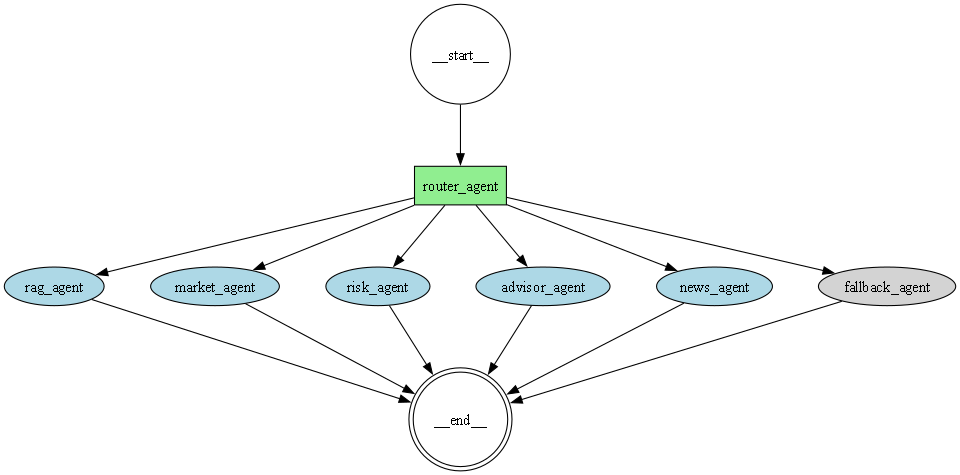

# 🧠 Finnie AI

An **Agentic Financial Assistant** built using LLMs, routing logic, and tool-based execution.
Finnie AI intelligently understands user queries and routes them to the correct agent such as **advisor, risk, market, news, or knowledge (RAG)**.

---

## 🚀 Overview

Finnie AI is designed to solve a core problem in AI systems:

> **How to correctly understand user intent and trigger the right capability**

Instead of relying purely on LLMs or rigid rules, Finnie AI uses a **hybrid routing system**:

* Lightweight rule-based signals for high-confidence cases
* LLM fallback for complex and ambiguous queries
* Modular agents for domain-specific execution

---

## 🧩 Key Features

* 🔀 Intelligent **Query Routing (Router Agent)**
* 📊 Market Data Integration (Stocks, Prices)
* 📰 News Retrieval
* ⚠️ Risk Analysis
* 💡 Investment Advisory
* 📚 RAG-based Knowledge Retrieval
* 🧠 Hybrid **Rule + LLM Decision System**
* 🌐 Streamlit UI for interaction

---

## 🏗️ Architecture

```text
User Query
   ↓
Preprocessing
   ↓
Router Agent (Core Brain)
   ├── Market Agent
   ├── Risk Agent
   ├── Advisor Agent
   ├── News Agent
   ├── RAG Agent
   ↓
Final Response
```


### 🔍 Router Logic

The router is the most critical component. It uses:

1. **Intent Detection**

   * Definition (what is, explain)
   * Decision (should, best, suggest)
   * Risk (safe, risky)
   * Market (price, value)
   * News (latest, update)

2. **Priority System**

   ```
   Market > News > Advisor > RAG > Risk
   ```

3. **Fallback Mechanism**

   * If rules are insufficient → LLM classification

---

## 🧠 Agents

| Agent             | Responsibility                           |
| ----------------- | ---------------------------------------- |
| **Advisor Agent** | Investment suggestions, portfolio advice |
| **Risk Agent**    | Risk/safety evaluation                   |
| **Market Agent**  | Stock prices, financial data             |
| **News Agent**    | Latest financial news                    |
| **RAG Agent**     | Definitions and explanations             |

---

## 🛠️ Tech Stack

### LLM & Agents

* LangChain
* LangGraph
* OpenAI

### Data & Processing

* Pandas
* NumPy

### RAG & Vector DB

* ChromaDB

### APIs

* Yahoo Finance (`yfinance`)
* Finnhub
* Tavily (search)

### UI

* Streamlit

---

## 📦 Requirements

```txt
# Python 3.12

# LLM + Agents
langchain==0.2.17
langchain-community==0.2.17
langchain-openai==0.1.23
langgraph==0.2.45
openai==1.43.0
langchain-chroma==0.1.4

# RAG / Vector DB
chromadb==0.5.3

# Data
pandas==2.2.2
numpy==1.26.4
matplotlib==3.8.4

# Market Data APIs
yfinance==1.3.0
finnhub-python==2.4.18

# Search APIs
tavily-python==0.3.3
google-search-results==2.4.2

# UI
streamlit==1.37.1

# Utilities
python-dotenv==1.0.1
tiktoken==0.7.0
pydantic==2.8.2
typing-extensions==4.12.2
httpx==0.27.0

# Visualization
graphviz==0.20.3
```

---

## ⚙️ Setup & Run Locally

### 1️⃣ Clone the repository

```bash
git clone https://github.com/your-username/finnie-ai.git
cd finnie-ai
```

---

### 2️⃣ Create virtual environment

```bash
python -m venv venv
venv\Scripts\activate   # Windows
# source venv/bin/activate  # Mac/Linux
```

---

### 3️⃣ Install dependencies

```bash
pip install -r requirements.txt
```

---

### 4️⃣ Setup environment variables

Create a `.env` file:

```env
# OpenAI (Required for LLM)
OPENAI_API_KEY=your_openai_api_key

# Market Data APIs
FINNHUB_API_KEY=your_finnhub_api_key
ALPHA_VANTAGE_API_KEY=your_alpha_vantage_key  # optional

# Search APIs
TAVILY_API_KEY=your_tavily_api_key
SERPAPI_API_KEY=your_serpapi_key  # optional

# Application Config
APP_USERS=user1,user2,user3          # optional (for access control)
API_KEYS=key1,key2,key3              # optional (internal API auth)
```

---

### 5️⃣ Run the application

```bash
streamlit run app.py
```

---

## 🧪 Running Tests

```bash
python -m tests.test_router
```

---

## 📊 Performance

* Router Accuracy: **100% (71/71 test cases)**
* Router Consistency: **87.5% (7/8 test cases)**
* Handles:

  * Mixed intent queries
  * Weak signal queries
  * Ambiguous phrasing
  * Noisy user inputs

---

## 🧠 Design Philosophy

* Minimal rules → Maximum generalization
* LLM for complexity, rules for certainty
* Avoid overfitting to test cases
* Build **robust, not perfect systems**

---

## 🚀 Future Improvements

* Confidence-based routing
* Feedback learning loop
* Embedding-based classification
* Fine-tuned intent classifier
* Multi-turn memory optimization

---

## 👨‍💻 Author

**Abhinav Anand**

---

## 📄 License

MIT License
