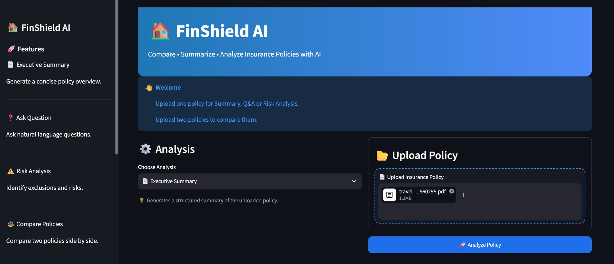
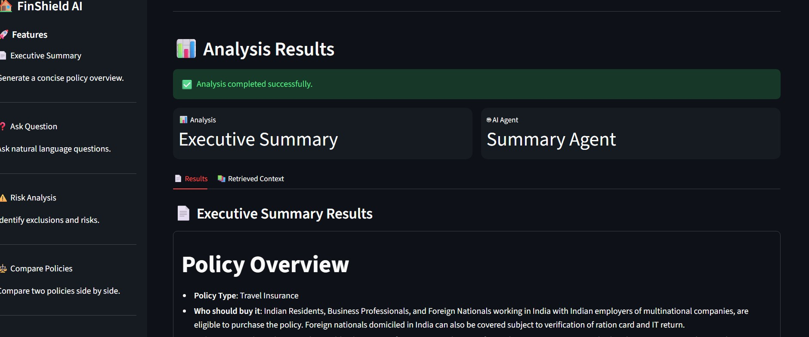
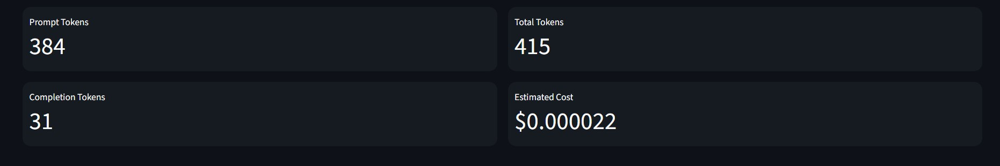
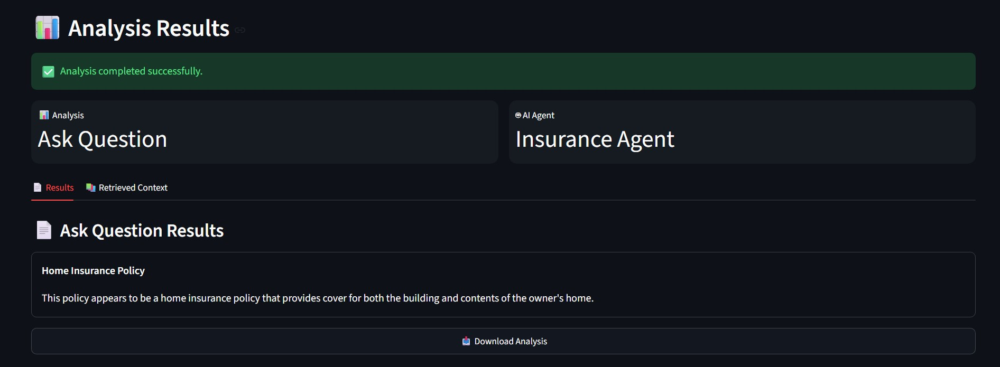
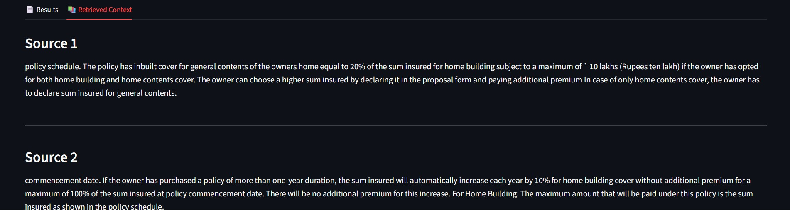

# 🏠 FinShield AI

> AI-Powered Insurance Policy Intelligence using Multi-Agent AI, RAG, ChromaDB and Groq LLM.

FinShield AI helps users understand complex insurance policies by leveraging Retrieval-Augmented Generation (RAG), Large Language Models (LLMs), and specialized AI agents. Users can upload insurance policies, ask questions, generate executive summaries, analyze risks, explain policy clauses, and compare multiple insurance policies.

---

## 🚀 Features

### 📄 Executive Summary
Generate a structured executive summary including:

- Policy Overview
- Coverage
- Major Exclusions
- Optional Covers
- Claim Process
- Important Things to Know
- Key Policy Numbers

---

### ❓ Ask Question

Ask natural language questions about the uploaded insurance policy.

Examples:

- What is covered?
- What is the waiting period?
- Is dengue covered?
- What is the claim process?
- What are the exclusions?

---

### ⚠️ Risk Analysis

Automatically identifies:

- Coverage gaps
- Major exclusions
- Hidden risks
- Waiting periods
- Deductibles
- Potential claim limitations

---

### 📘 Explain Clause

Paste any difficult insurance clause and receive a simple, easy-to-understand explanation.

Example:

**Input**

> The Company shall not be liable for any claim arising out of Pre-existing Disease until completion of 36 continuous months.

**Output**

> This means that any illness you had before purchasing the policy will not be covered for the first 36 months.

---

### ⚖️ Compare Policies

Compare two insurance policies side-by-side.

Comparison includes:

- Coverage
- Premium
- Waiting Period
- Exclusions
- Claim Process
- Pros & Cons
- Overall Recommendation

---

# 🏗 System Architecture

```
                                                User
                           │
                           ▼
                  Streamlit Web UI
                           │
                           ▼
                    Router Agent
                           │
      ┌──────────┬──────────┬──────────┬──────────┐
      │          │          │          │
      ▼          ▼          ▼          ▼
 Insurance   Summary     Risk     Comparison
   Agent      Agent      Agent       Agent
      └──────────┴──────────┴──────────┘
                           │
                           ▼
                     RAG Pipeline
                           │
         ┌─────────────────┴─────────────────┐
         │                                   │
         ▼                                   ▼
 PDF Processing                  User Question
         │                                   │
         ▼                                   │
Sentence Transformers                         │
         │                                   │
         ▼                                   │
     ChromaDB (Vector Store) ◄───────────────┘
                 │
                 ▼
      Retrieve Relevant Chunks
                 │
                 ▼
             Groq LLM
                 │
                 ▼
          AI Generated Response
```

---

# 🧠 AI Workflow

1. Upload Insurance Policy
2. Extract text from PDF
3. Chunk policy into smaller documents
4. Generate embeddings
5. Store embeddings in ChromaDB
6. Retrieve relevant context
7. Route request to specialized AI Agent
8. Generate final response using Groq LLM

---

# 🤖 Multi-Agent Architecture

| Agent | Responsibility |
|--------|---------------|
| Insurance Agent | Answers policy-related questions |
| Summary Agent | Generates executive summaries |
| Risk Agent | Performs policy risk analysis |
| Comparison Agent | Compares two insurance policies |

---

# 🛠 Technology Stack

## Frontend

- Streamlit

## Backend

- Python

## LLM

- Groq
- Llama 3

## Vector Database

- ChromaDB

## Embeddings

- Sentence Transformers
- all-MiniLM-L6-v2

## PDF Processing

- PyPDF

## RAG Framework

- LangChain

---

# 📂 Project Structure

```
finshield_ai/

│
├── app/
│   ├── agents/
│   │   ├── insurance_agent.py
│   │   ├── summary_agent.py
│   │   ├── risk_agent.py
│   │   ├── comparison_agent.py
│   │   └── router.py
│   │
│   ├── prompts/
│   │
│   ├── ui/
│   │   ├── streamlit_app.py
│   │   └── style.css
│   │
│   └── utils/
│
├── rag/
│   ├── ingest.py
│   ├── retrieve.py
│   └── vector_store.py
│
├── data/
│
├── chroma_db/
│
├── requirements.txt
│
└── README.md
```

---

# 💻 Installation

Clone the repository

```bash
git clone https://github.com/yourusername/finshield-ai.git

cd finshield-ai
```

Create virtual environment

```bash
python -m venv finshield_ai

source finshield_ai/bin/activate

# Windows

finshield_ai\Scripts\activate
```

Install dependencies

```bash
pip install -r requirements.txt
```

Configure environment variables

Create a `.env` file

```text
GROQ_API_KEY=your_groq_api_key
```

Run the application

```bash
streamlit run app/ui/streamlit_app.py
```

---
# 📸 Screenshots

## 🏠 Home Page



---

## 📄 Executive Summary



---

## ⚠️ Risk Analysis



---

## 📘 Explain Clause



---

## ⚖️ Policy Comparison




---

# 🎯 Example Use Cases

✔ Understand complex insurance policies

✔ Compare two insurance plans

✔ Explain difficult policy clauses

✔ Identify hidden exclusions

✔ Retrieve policy information instantly

✔ Generate executive summaries

---

# 🔮 Future Enhancements

- LangGraph workflow orchestration
- OCR support for scanned policies
- Multi-language policy understanding
- Voice-based insurance assistant
- Policy recommendation engine
- Premium prediction
- Claim eligibility prediction
- Authentication & user accounts
- Cloud deployment (Azure / AWS)

---

# 👨‍💻 Author

**Abhinav Anand**

Senior AI Engineer

MSc Artificial Intelligence & Machine Learning

---

# 📄 License

This project is developed for educational and demonstration purposes as part of a Generative AI Capstone Project.

---
